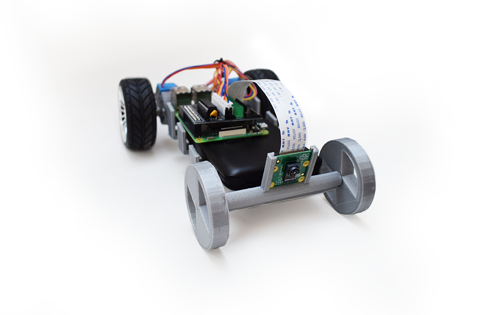

This is the source code for the AutCar project - Build your own autonomous driving toy car!

## Getting started

### 1) Hardware Prerequisites

You have two options: Either get a development kit with all hardware parts ready and packed for you at [www.autcar.com](http://www.autcar.com).

Or, collect (and print) all the parts yourself. You will need the following:

1) A Raspberry Pi 3 (important: the original Raspberry Pi or Raspberry Pi Zero (WH) **won't work**. You need a chip with ARMv7 processor).
2) Two motors and an expensian board to connect both to your Raspberry Pi.
3) A camera (either an USB webcam or a Raspberry Pi cam).
4) A battery pack to run your Raspberry Pi.
5) 3D printed chassis and wheels. You can find sample models [here](https://github.com/christian-vorhemus/autcar/tree/master/src/3dmodels).

### 2) Setup

Do you have all the parts listed above? Great, next please follow the guide [here](https://github.com/christian-vorhemus/autcar/blob/master/src/README.md) to install all dependencies and start the car.

## FAQ & troubleshooting
<i>Q: I have trained a machine learning model but the car is not following the lines.</i>

A: This could have multiple reasons
  <ul>
<li>Check the training images and see if you are able to distinguish what direction a car should move just by looking at a specific image. If you can't do it, the model can't do it.</li>
  <li>You need more training data (at least 500 images per class is recommended)</li>
<li>The lighting conditions are poor or the markings are barely highlighted compared to the ground</li>
    </ul>

  <i>Q: The battery pack and/or Raspberry Pi are only loosely attached to the car</i>

A: This is correct for Model One, the Raspberry Pi is just loosely placed on top of the battery pack.

<i>Q: The engine mounting in the rear area is worn out and the engines are no longer stable. What can I do?</i>

A: The motors produce heat which will deform the mounting. This is an expected by-effect. You can do two things:
1) Remove the motors and heat the area with a hair dryer. Then carefully bend the ends closer together again. Cool down the chassis and put the motors back
2) Put a rubber band over both engine brackets.
  

