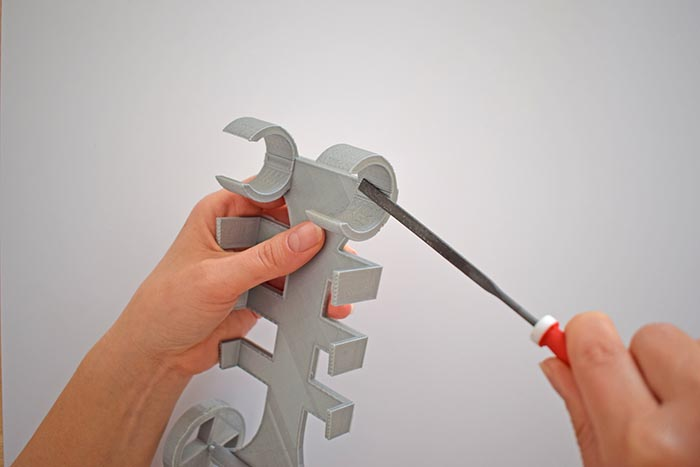
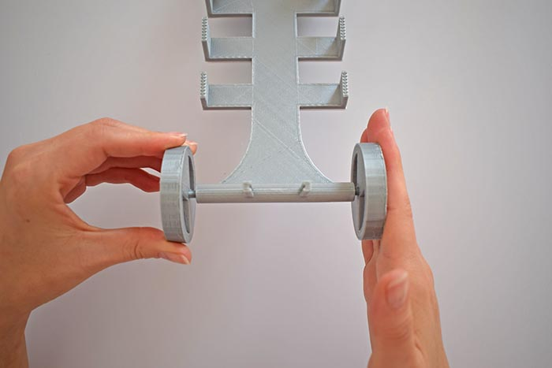
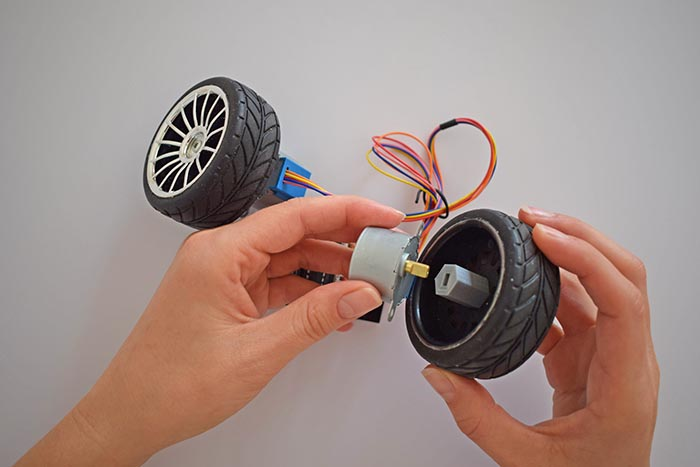
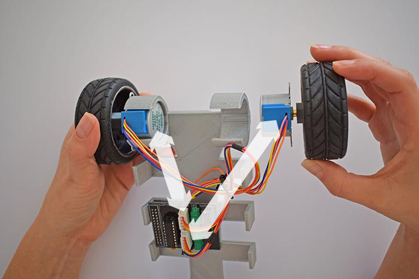
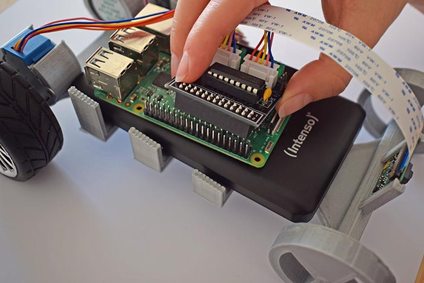

# Hardware Assembly

In this chapter you'll see how to assemble all the hardware parts to construct your car!

### 1) Prepare all parts
Make sure you have all parts next to you before you start
- The chassis (underbody)
- 2x motors (we use 5V 28BYJ-48 stepper motors)
- 2x motor-wheel connectors
- Battery pack
- Expansion board to connect motors and Raspberry Pi
- 2x gummed back wheels
- 2x front wheels (including axle)
- Raspberry Pi 3
- Raspberry Pi Camera
- 2x screws

Depending on where you live, you will get all these parts easily at your electronics retailer. The chassis and wheels can be 3D printed based on [these](https://github.com/christian-vorhemus/autcar/tree/master/3dmodels) models. If you don't want to collect the parts yourself, you can get a ready-to-use development kit [here](https://www.autcar.com/index.php?route=product/product&product_id=50).

Additionally, you will need the following:
- Crosstip screwdriver
- Scissors or a stanley knife
- File (optional)

First, remove the brim from the motor-wheel connectors. You can do this either by hand or with the help of a scissor

Do the same with the chassis:

Check if you can put one of the motors into the motor bracket. You should feel a certain resistance but the brackets shouldn't bend too much. You may want to use a file and carefully abrade the little bulge in the motor bracket:

### 2) Front wheels
Take the wheel with axle and put it through the front part of the chassis. Then, with some pressure put the other wheel on it. Again, you may want to **use a file** to carefully abrade the axle which makes it easier to assemble the front wheel part.

### 3) Back wheels
Take the motor-wheel connector and place it in the wheel so the rectangular part is visible from the back side:

Next, screw the motor-wheel connector to the wheel.

Repeat with the second back wheel and plug the motor-wheel connector on the motors.

Afterwards, plug both motors into the motor bracket. Make sure the motors are connected as shown in the image below.

### 4) Connect all parts
Gently place the battery pack in the chassis and put the Raspberry Pi on top of it. There is no need to fasten it. Now, plug the motors into the expansion board and put the expansion board on the GPIO pins as shown in the image below:

Last, plug the camera into the Raspberry Pi Camera CSI interface and fix it in the front mounting. The battery pack has a built-in micro USB cable you can use to power the Raspberry Pi. Don't power up your device yet, first prepare a micro SD card with the operating system on it. You'll learn how to do this in a second.

Your car is ready, perfect! Next, let's install the software, click [here](2_Software_Setup.md)
