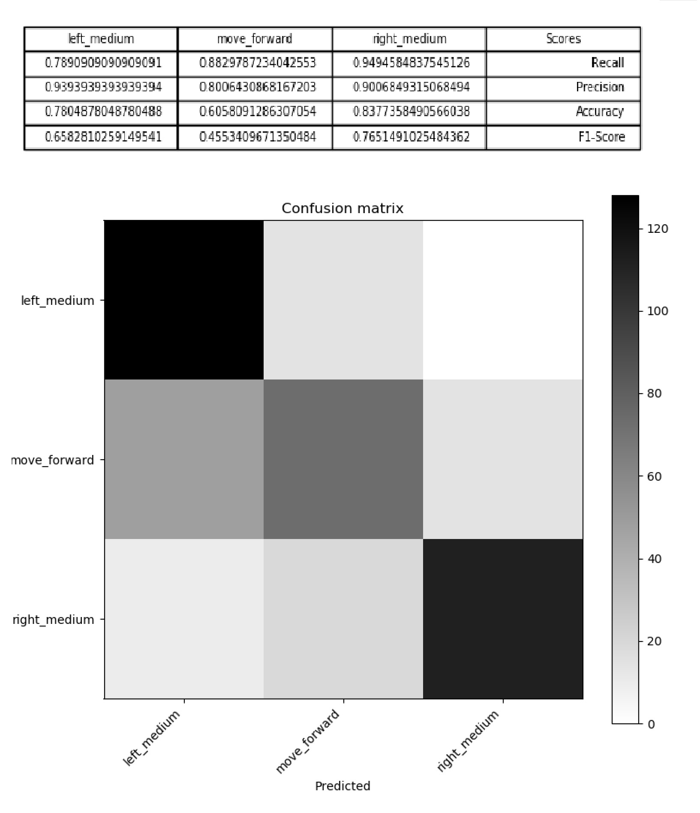
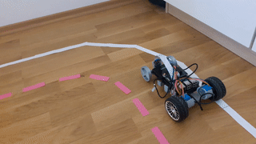

# Autonomous Driving

This documents gives an overview how you can collect training data, train the car and start the autonomous driving mode.

### 1) Create track

Your car has to know when it is "on track" and when it leaves the track. Therefore, you need to prepare a circuit that has the following properties:
- The boundaries of the track should be clearly distinguishable from the ground.
- The right and left borders should have different colors.
Below, you see an example of a suitable track


Also make sure that the track is wide enough for the car to be able to take bends well.


Additionally, take the the following into account:
- Choose a room with uniform lighting. Backlighting can deteriorate the result.
- The total circuit size should not exceed the size of 2 by 2 meters.

### 2) Capture training data

1. On your Raspberry Pi, start the sample remote control script rc_sample.py
 ```
 python3 rc_sample.py
 ```

 Your car is now listening for commands.

2. On your PC, start the web client with
 ```
 python autcar/src/autcar/web/server.py
 ```

3. In the AutCar Control Board, connect to your car by entering the IP address and port in the upper right corner, click "Connect" and try if the connection works by clicking one of the control buttons.

4. Place the car on the circuit - we are ready to record training data now!

5. In the data recording section, click on "START". You should see a red dot flashing - this means we are recording data.


6. Start driving your car manually by using the control buttons while the "REC" icon is flashing. **Note**: If you want to make life easier for the model, use as few commands as possible, for example don't use fast mode, don't use the "light" left or right buttons. If you use them, the predictions may become less accurat.
Drive several rounds (we recommend to record at least 10 fully driven rounds) and when you're done, press the "STOP" button.

7. Stop the execution of the rc_sample.py script on your Raspberry by entering Ctrl+C and type
 ```
 ls
 ```
 You should see a new folder named "autcar_training". This folder contains images and a transcript of the commands you entered while driving the car.
 
 8. Copy the folder to your Desktop computer, we'll use the Secure Copy Protocol (SCP) for this. On your PC, open a command prompt and enter
 ```
 scp -r pi@192.168.1.101:/home/pi/autcar/src/autcar_training .
 ```
 Note: You **have to change the IP address** in the command above the the IP address of your car as well as the path to your autcar_training directory. The copying process may take a while
 
9. Look into the autcar_training folder, it should contain several images and a train.csv file.


### 3) Train your model

1. On your PC, open the file `autcar/src/training_sample.py`
2. Find the line that starts with `trainer.create_balanced_dataset` Replace the first parameter of the `create_balanced_dataset()` function with the path to your `autcar_training` folder, for example
 ```
 trainer.create_balanced_dataset("C:/Users/me/Desktop/autcar_training", outputfolder_path="C:/Users/me/Desktop/autcar_training_balanced")
 ```
 This function takes our dataset and *balances* it (ensures, that each class like "left" or "right" occurs the same number of times.)
 The output of the function is another directory, in this example it can be found at `C:/Users/me/Desktop/autcar_training_balanced`.

 3. Next, find the line that starts with `trainer.train` and modify the path so it points to the output path of the  `create_balanced_dataset()` function.
 4. Finally, find the line that starts with `trainer.test` and modify the second parameter so it points to the `test_map.txt` file (which is generated by executing the `create_balanced_dataset()` function)
 
 5. Start training by executing this script
  ```
 python autcar/src/training_sample.py
  ```
  Training will roughly take 30-60 minutes with ~2000 images and 20 epochs depending on your PC. The output should be a file named `driver_model.onnx`

### 4) Test your model

1. In the `training_sample.py` file, find the line that starts with `trainer.test`
2. Change the first parameter so it points to the .onnx model you created with `trainer.train()` and the second parameter to point to the balanced dataset `test_map.txt` file
3. Run the function. You get two images as an output: A confusion matrix and a table containing several different scores:

    
    
 In this example you see that the model is pretty good at prediction "right" and "left" but confuses "left" and "forward" from time to time. In the table you see that the accuracy for prediction the class "forward" correctly is just about 60% - this is pretty low and tells us that we should improve the model in the next step.

### 5) Run model on your AutCar

1. Transfer your model to the autcar/src folder of your Raspberry Pi. Open an command prompt on your PC and type
 ```
 scp path/to/driver_model.onnx pi@192.168.1.101:/home/pi/autcar/src
 ```
 
2. On your Raspberry Pi shell, run `driver_sample.py` by typing
 ```
 python3 driver_sample.py
 ```

3. Your car should start moving after a few seconds. 

