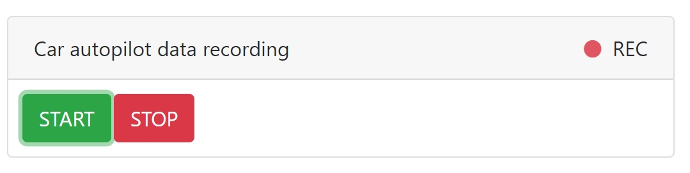

# Autonomous Driving

This documents gives an overview how you can collect training data, train the car and start the autonomous driving mode.

### 1) Create track

Your car has to know when it is "on track" and when it leaves the track. Therefore, you need to prepare a circuit that has the following properties:
- The boundaries of the track should be clearly distinguishable from the ground.
- The right and left borders should have different colors.
- The floor should be smooth, carpets do not work.

Below, you see an example of a suitable track


Also make sure that the track is wide enough for the car to be able to take bends well.


Additionally, take the the following into account:
- Choose a room with uniform lighting. Backlighting can deteriorate the result.
- The total circuit size should not exceed the size of 2 by 2 meters.

### 2) Capture training data

1. On your Raspberry Pi, start the sample remote control script rc_sample.py
 ```
 python3 rc_sample.py
 ```

 Your car is now listening for commands.

2. On your PC, start the web client with
 ```
 python src/autcar/web/server.py
 ```

3. In the AutCar Control Board, connect to your car by entering the IP address and port in the upper right corner, click "Connect" and try if the connection works by clicking one of the control buttons.

4. Place the car on the circuit - we are ready to record training data now!

5. In the data recording section, click on "START". You should see a red dot flashing - this means we are recording data.



6. Start driving your car manually by using the control buttons while the "REC" icon is flashing. Drive several rounds (we recommend to record at least 10 fully driven rounds) and when you're done, press the "STOP" button.

7. Stop the execution of the `rc_sample.py` script on your Raspberry by entering Ctrl+C and type
 ```
 ls
 ```
 You should see a new folder named "autcar_training". This folder contains images and a transcript of the commands you entered while driving the car.
 
 8. Copy the folder to your Desktop computer, we'll use the Secure Copy Protocol (SCP) for this. On your PC, open a command prompt and enter
 ```
 scp -r pi@192.168.1.101:/home/pi/autcar/src/autcar_training .
 ```
 Note: You **have to change the IP address** in the command above the the IP address of your car as well as the path to your autcar_training directory. The copying process may take a while
 
9. Look into the autcar_training folder, it should contain several images and a train.csv file.


### 3) Train your model

1. On your PC, open the file `autcar/src/training_sample_keras.py`. You can also use `training_sample_cntk.py` or `training_sample_pytorch.py`, in that case make sure you have [CNTK](https://docs.microsoft.com/en-us/cognitive-toolkit/Setup-CNTK-on-your-machine) or [PyTorch](https://pytorch.org/) installed on your PC (you don't need these libraries on your Raspberry)
2. Find the variable `input_folder_path` and set the path to the folder on your PC where your images you just collected are located. We use this path in the method `trainer.create_balanced_dataset()`. This function takes our dataset and *balances* it (ensures, that each class like "left" or "right" occurs the same number of times.)
 The output of the function is another directory, this must be set in the variable `output_folder_path` and can be an arbitrarily path, we recommend to put it in the same location as your initial dataset.
 3. Start training by executing this script
  ```
 python src/training_sample_keras.py
  ```
 Training will roughly take 30-60 minutes with ~2000 images and 20 epochs depending on your PC. The output should be a file named `driver_keras.onnx`

### 4) Test your model

1. After training, we call the method `trainer.test()` to test how well out model performs. The method `trainer.create_balanced_dataset()` has created two files for us, `train_map.txt` and `test_map.txt`. `train_map.txt` contains a list of path to images and the corresponding command we want to predict. `test_map.txt` was not used for training but can now be used to evaluate the model.
2. When you run `trainer.test()` you get two images as an output: A confusion matrix and a table containing several different scores:

    
    
 The confusion matrix compares the predictions the model makes with the expected values (ground truth). Take a look at the first column: It contains all the predictions the model made for driving left. And as you see in the first row, the majority of predictions for driving left were actually correct. In the second row (still first column) you see in some cases the model predicted to drive left when actually driving forward was the correct command. This rectangle is light grey, it means we have fewer predictions on this (wrong) label than for the right class. Ideally, our confusion matrix shows us a diagonal black line from top left to bottom right.
 
 **Note**: In the case above, we just used three commands. If you used more commands during data collection, your confusion matrix will contain more rows and columns.
 
 In the table you see that the accuracy for predicting the class "forward" correctly is 71% - this is okay but we could do better, we'll take a look on how we increase accuracy of our models in one of our tutorials.

### 5) Run model on your AutCar

1. Transfer your model to the autcar/src folder of your Raspberry Pi. Open an command prompt on your PC and type
 ```
 scp path/to/driver_keras.onnx pi@192.168.1.101:/home/pi/autcar/src
 ```
 
2. On your Raspberry Pi shell, run `driver_sample.py` by typing
 ```
 python3 driver_sample.py
 ```

3. Your car should start moving after a few seconds. 

