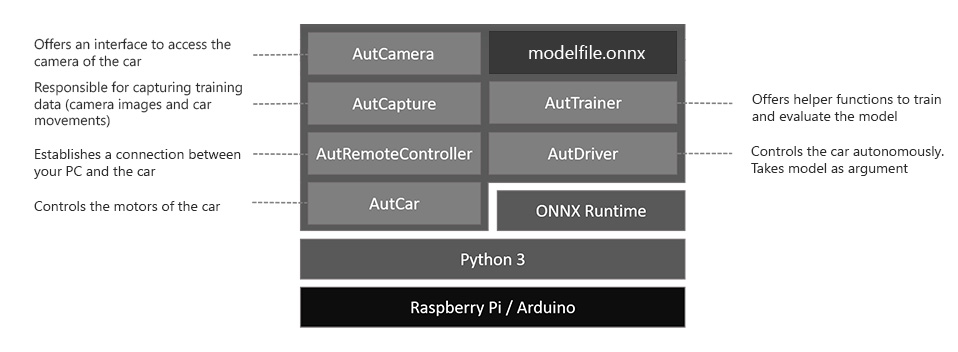

# Overview of AutCar

This tutorial gives an overview of the AutCar library and some detailed information about the training process and useful methods. As a prerequisites, make sure that your car is [assembled](https://github.com/christian-vorhemus/autcar/blob/master/docs/1_Hardware_Assembly.md), the [software is installed](https://github.com/christian-vorhemus/autcar/blob/master/docs/2_Software_Setup.md) and you have an open SSH connection to your car.

## The library

The AutCar library consists of indepependent modules depicted in the image below:



- **AutCamera** offers an abstraction layer to access the Raspberry Pi camera. Under the hood, OpenCV `cv2.VideoCapture` is used to capture frames. AutCamera uses the first video capturing device it finds (index 0). If you have multiple cameras attached, you may change the device manually [here](https://github.com/christian-vorhemus/autcar/blob/master/src/autcar/AutCamera.py#L34).
- **AutCapture** is used to create training data. It needs a camera and a car object to work as it takes the current camera frame and the current car commands for data recording.
- **AutCar** is used to control the motors. For Model One, two standard stepper motor are used controlled by the GPIO Pins `[11,12,13,15]` for the left motor and `[16,18,22,7]` for the right motor.
- **AutDriver** takes one or several machine learning model files in ONNX format and an execution function and constantly performs the actions defined in the execution function based on the machine learning model predictions.
- **AutRemoteController** offers functions to open up a connection between your PC and the car over sockets.
- **AutTrainer** provided some helper functions to create a balanced dataset or to train a model.

## Start the engines

Let's write a simple script that controls the motors. On your car, create a python script called `motor_test.py` in the same folder where your main `autcar` directory is located. 

  ```
  nano motor_test.py
  ```

Copy the following code into the file:

  ```python
  from autcar import Car
  import time
  
  car = Car()
  
  car.move()
  time.sleep(3)
  car.stop()
  ```
  
  Then execute the code with
  
   ```
   python3 motor_test.py
  ```
  
  This script creates a car object and calls the `move()` method which tells the car to drive forward. Then, we wait for three seconds until we stop the car.
 
 Lets play around with this methods even more: The following code generates a random integer between 0 and 3 and controlls the car based on this number. This happens 5 times until the car is stopped:
  ```python
  from autcar import Car
  import random
  import time
  
  car = Car()
  
  for x in range(5):
    cmd = random.randint(0,4)
    print(cmd)
    if(cmd == 0):
      car.move("forward")
    elif(cmd == 1):
      car.move("backwards")
    elif(cmd == 2):
      car.left("light")
    else:
      car.right("light")
    time.sleep(3)
    
  car.stop()
  ```
  You can pass arguments to the methods to specifiy in more detail what to do. For example, the first argument in `move()` method tells the car in which direction to move (supported are "forward" and "backwards"). The first argument in `left()` or `right()` tells the car how strong it should change the direction (supported are "light", "medium" and "harsh").
  
## Create a live stream from your car

Let's take a look at some code how we can open a connection from our PC to the camera of our car. Create a file called 
  ```python
  from autcar import Camera

  cam = Camera(rotation=-1)
  cam.listen()
  ```

## Create training data

If our car should drive autonomously, we have to teach it how to drive. For this reason, we have to save
