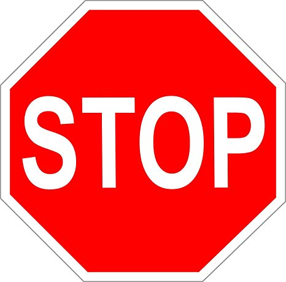
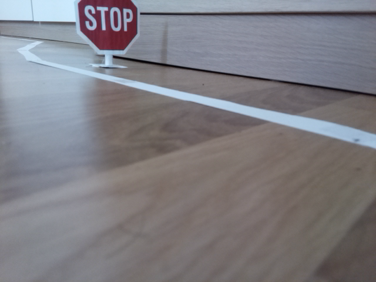
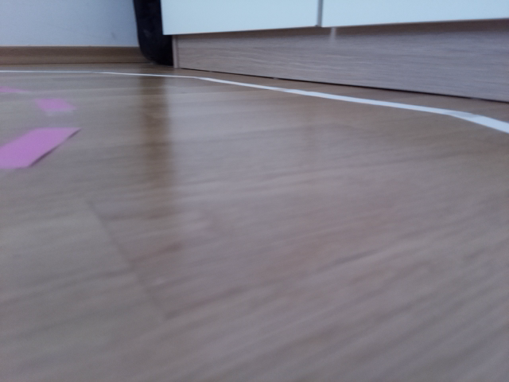
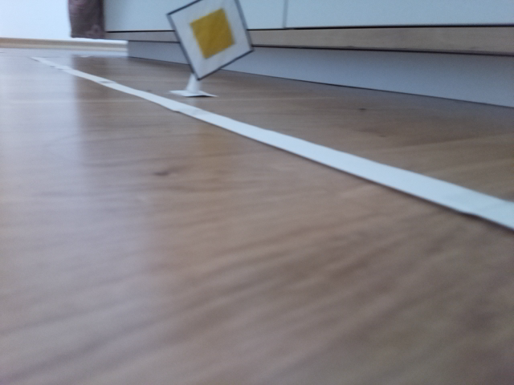
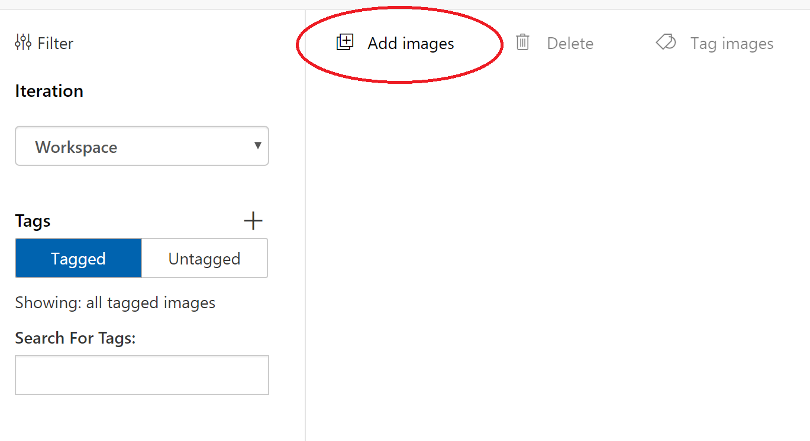
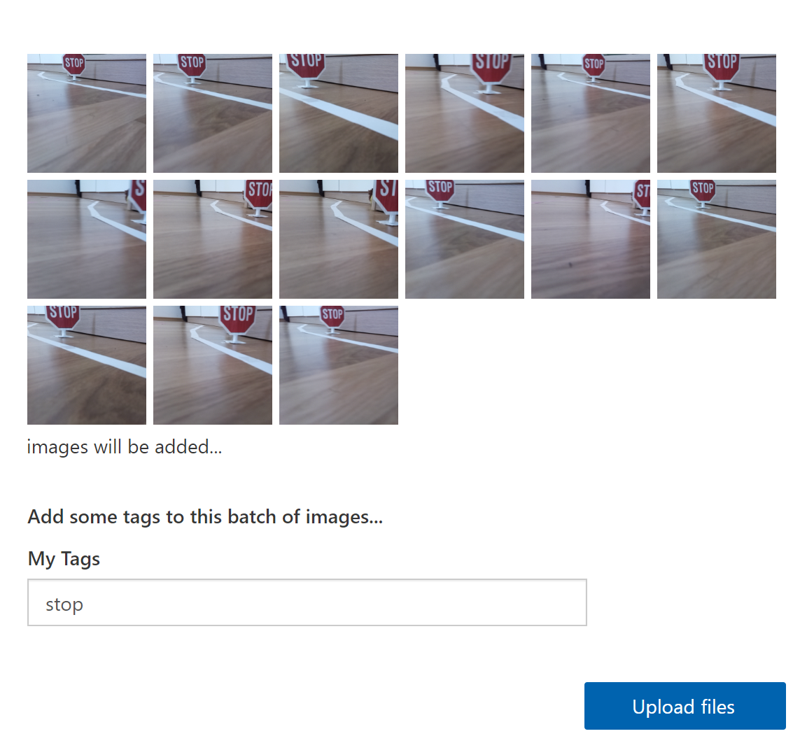
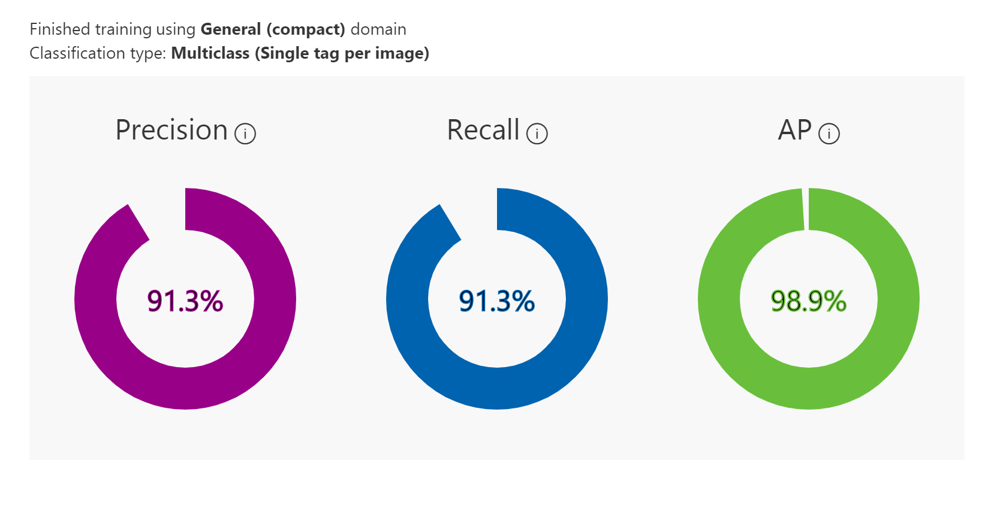
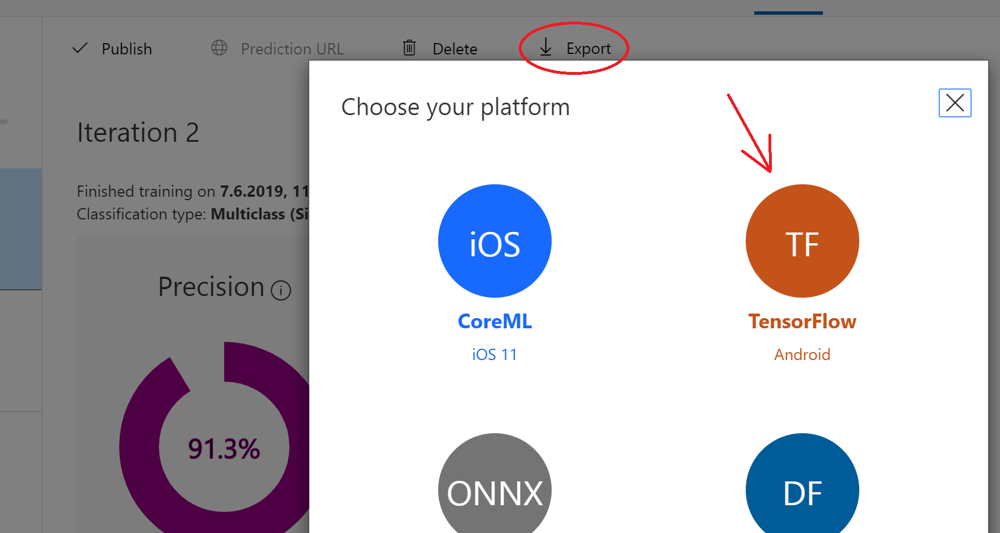
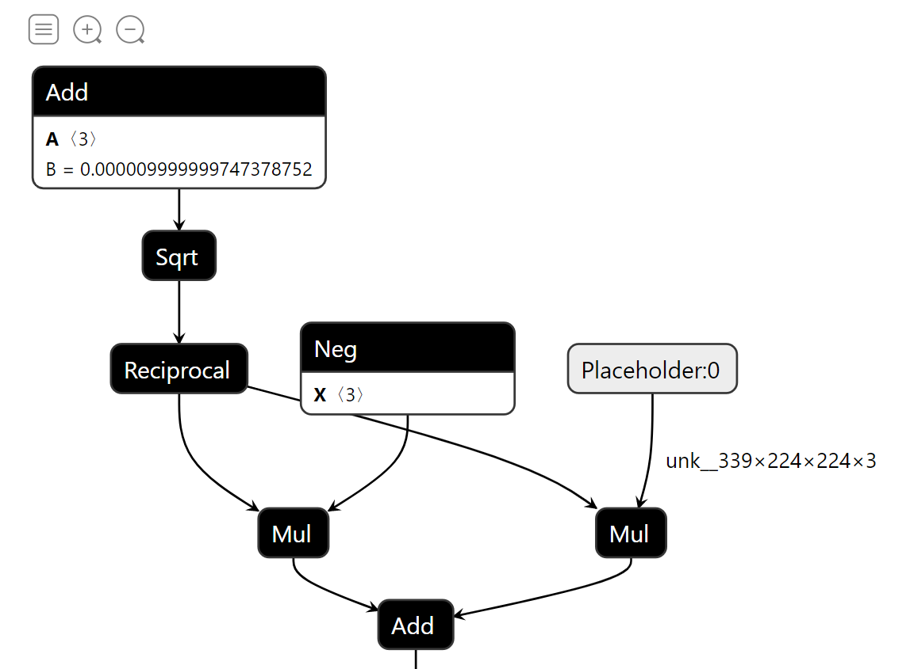
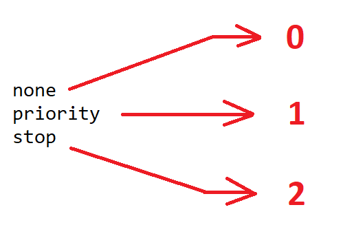

# Use Microsoft Custom Vision to train a model

In this tutorial we will learn how to use the customvision.ai online service to train a model. This works completely without code, the trained model can be downloaded as a file. We aim to create a traffic sign detector: Our car should be capable of recongizing two different traffic signs:

<p float="left">
  
   
</p>

## Why using Custom Vision?

We can train and execute our model locally without any other services. However, very often, especially when dealing with large training or when large computing power is required, cloud services are used. Additionally, there is a variety of services that offer a zero-code interface to train models. Custom Vision is one of them. With Custom Vision you can simply upload images, add a label and train a model. Custom Vision makes use of **transfer learning**, meaning that a base model was already trained on million of images and the already learned model weights are fine tuned with the images you add. This is a state-of-the art technique to create very accurate and precise models.

## Create an Azure account and configure Custom Vision

1) You need an Azure subscription to use Custom Vision. If you don't have one yet, you can start with a free account [here](https://azure.microsoft.com/free/). You have to enter some information including an email address which you can then use to sign in.

2) Go to [www.customvision.ai](https://www.customvision.ai) and sign in with the email address you just provided. Accept the conditions and you should see the empty start page

  

3) Click on "New Project". Add a name and create a new Resource Group. When adding a new Resource Group you have to provide a name, a subscription you want to use and the location where your resource group is placed.

4) Now you should be able to add additional configurations for your project: Choose "Classification" as a project type and "Multiclass" as the classification type. For the domain, choose a **compact** one (only compact models can be exported), let's just take "General (compact)" and for the "Export Capabilities" select "Basic platforms". Create the project.

## Create and upload training data

1) Before we can train the model, we need training data. Since it's our goal to recognize traffic signs next to our road, print out the above signs and glue them to small sticks so you can place them next to the track.

2) When your track is prepared, power up your car and start the `rc_sample.py` file in your _autcar_ folder on your Raspberry Pi. Follow the procedure as described [here](3_Autonomous_Driving.md) tutorial to learn more) to create training data. 

3) After you transfered the trainign data from your car to your PC, take a look at the images: We basically have three cases: Images where a stop sign is visible, images where a major road sign is visible and images where no traffic sign is visible

<p float="left">
  
  
   
</p>

Pick **at least 50** images for each of the three categories you want to use for training. Also make sure you use roughly the same amount of images for each category.

4) In Custom Vision, click on "Add images" and choose all your selected images which contain a stop sign. 



5) Add a label for your images. In this example, we choose "stop". Upload the images and repeat the same procedure with the remaining two categories. We named the other two labels "none" when no traffic sign is visible and "priority" for the major road sign.



6) Click on the green "Train" button on top of your project and select "Fast Training". Training the model should take under one minute. Afterwards you'll see the training results:



Precision tells us, for example if the model predicted that on a certain image there is a stop sign, how likely is it that there really is a stop sign visible?

Recall is a measure how well out model finds the correct sign on an image. As an example: Out of all stop signs in the data set, how likely is it that our model finds them?

AP means "Average Precision". 

## Download and convert the model

1) Click on the "Export" button in the header. If this button is grey, you didn't select a "compact" model when creating the project. In the modal window, you'll see several model formats you can choose to download:



2) Download the "TensorFlow" model (don't pick the "ONNX Windows ML" option!). Unzip the package you get, you should see two files, `model.pb` and `labels.txt`. 

3) We have to convert this model into a format our car can use. We'll use the [tensorflow-onnx model converter](https://github.com/onnx/tensorflow-onnx) to do this. Run the following script on your PC (assuimg TensorFlow is already installed)

```
pip install -U tf2onnx
```

Now run the following command. Make sure you're in the same directory as `model.pb`

```
python -m tf2onnx.convert --input model.pb --output model.onnx --inputs "Placeholder:0" --outputs "loss:0"
```

You should get a new file called `model.onnx`. This is the model we'll use for our car.

## Write a custom model preprocessor

Before an input image can be handeled by the model, it has to be preprocessed. When you use the `AutTrainer` module and the `train()` method, this preprocessing is done for you automatically. When you use an external model, we have to bring the image into the right format so the model can use it. 

Let's take a closer look at the `model.onnx` file we just created. With a tool called [Netron](https://github.com/lutzroeder/netron) we can inspect how the model looks like:



You see at "Placeholder:0" that our images must have the format [224x224x3] - this is not what we get from our car camera. To resize the image, create a new file called `trafficsign_sample.py` and add the following code:

```python
from autcar import Camera, Model
import numpy as np
import cv2

cam = Camera(rotation=-1)

class OwnModel(Model):
  def preprocess(self, image):
    image = image.convert('RGB')
    r,g,b = np.array(image).T
    image = np.array([b,g,r]).transpose()
    h, w = image.shape[:2]
    min_dim = min(w,h)
    startx = w//2-(min_dim//2)
    starty = h//2-(min_dim//2)
    image = image[starty:starty+min_dim, startx:startx+min_dim]
    resized_image = np.array([cv2.resize(image, (224, 224), interpolation = cv2.INTER_LINEAR)])
    
    return resized_image
```

Here we create a sub class `OwnModel` which inherits from the `Model` base class. We overwrite the `preprocess` method which is transforming the image before feeding it into the model. Step by step, here is what happens:

- We get an RGB image, so the red channel is the first array. Our Custom Vision model expects images in the BGR format. Therefore, we split the channels and glue them together again in the expected order.
- Next we get the height (h) and width (w) of our image and get the smaller edge with `min()`. The next three lines crop the image along the larger edge so that we get a square image which is then resized to the size 224x224
- Finally we return the resized_image

Now let's execute this model. We make use of our `Driver` class here even though for testing we don't really want the car to drive but just take a look at the real-time model predictions. Add the following code after the `OwnModel` class definition:

```python
model_trafficsigns = OwnModel("model.onnx", execution_interval=2, name="traffic_model")

def execute(model_predictions: dict, car: Car):
    print(model_predictions["traffic_model"][0])

driver = Driver(model_trafficsigns, None, cam, execution_function=execute, execution_interval=3)
driver.start()
```

First we create a model object with our `model.onnx` file. We also define that this model should be executed every two seconds. We also name this model to refer to it later.

Next we define a function `execute` which will be handed over to the `Driver` class. This standard function will get two arguments by `Driver`, a dictionary of predictions and the car object. `model_predictions` contains all predictions of all models we execute, in this case we just have one. In `execute` we print the results of the model predictions. The result is a list of the last 5 predictions the model made, index 0 holds the most recent predictions as an integer value. If we want to map back this integer value to a label, take a look into the `labels.txt` file you downloaded earlier:



So if our model predicts "0", it means no traffic sign was detected.

Finally, run this script:

```
python trafficsign_sample.py
```

The script is now capturing data from the camera and prints the predictions (0 = No sign detected, 1 = major road sign detected, 2 = stop sign detected). Place the car infront of a sign to see how the predictions change.
