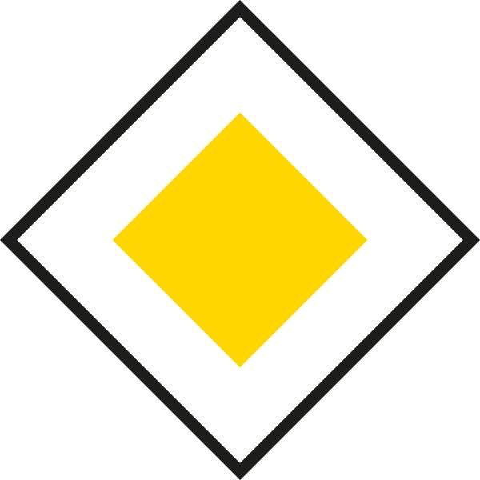
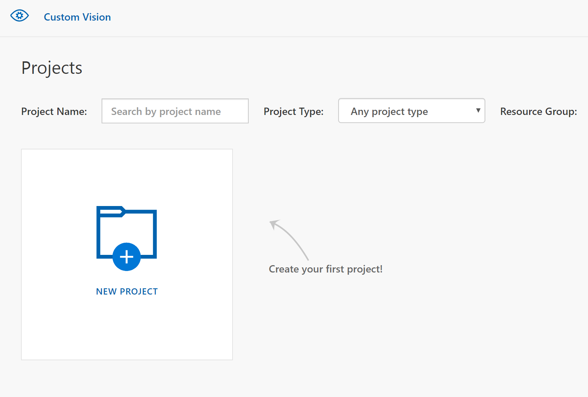

# Use Microsoft Custom Vision to train a model

In this tutorial we will learn how to use the customvision.ai online service to train a model. This works completely without code, the trained model can be downloaded as a file. We aim to create a traffic sign detector: Our car should be capable of recongizing two different traffic signs:

  
   

## Why using Custom Vision?

We can train and execute our model locally without any other services. However, very often, especially when dealing with large training or when large computing power is required, cloud services are used. Additionally, there is a variety of services that offer a zero-code interface to train models. Custom Vision is one of them. With Custom Vision you can simply upload images, add a label and train a model. Custom Vision makes use of **transfer learning**, meaning that a base model was already trained on million of images and the already learned model weights are fine tuned with the images you add. This is a state-of-the art technique to create very accurate and precise models.

## Create an Azure account and configure Custom Vision

1) You need an Azure subscription to use Custom Vision. If you don't have one yet, you can start with a free account [here](https://azure.microsoft.com/free/). You have to enter some information including an email address which you can then use to sign in.

2) Go to [www.customvision.ai](https://www.customvision.ai) and sign in with the email address you just provided. Accept the conditions and you should see the empty start page

  

3) Click on "New Project". Add a name and create a new Resource Group. When adding a new Resource Group you have to provide a name, a subscription you want to use and the location where your resource group is placed.

4) Now you should be able to add additional configurations for your project: Choose "Classification" as a project type and "Multiclass" as the classification type. For the domain, choose a **compact** one (only compact models can be exported), let's just take "General (compact)" and for the "Export Capabilities" select "Basic platforms". Create the project.

## Create and upload training data

1) Before we can train the model, we need training data. Since it's our goal to recognize traffic signs next to our road, print out the above signs and glue them to small sticks so you can place them next to the track.

2) When your track is prepared, power up your car and start the `rc_sample.py` file in your _autcar_ folder on your Raspberry Pi. Follow the procedure as described [here](3_Autonomous_Driving.md) tutorial to learn more) to create training data. 

3) After you transfered the trainign data from your car to your PC, take a look at the images: We basically have three cases: Images where a stop sign is visible, images where a major road sign is visible and images where no traffic sign is visible

  
  
   

Pick **at least 50** images for each of the three categories you want to use for training. Also make sure you use roughly the same amount of images for each category.

4) In Custom Vision, click on "Add images" and choose all your selected images which contain a stop sign. 

5) Add a label for your images. In this example, we choose "stop". Upload the images and repeat the same procedure with the remaining two categories. We named the other two labels "none" when no traffic sign is visible and "priority" for the major road sign.

6) Click on the green "Train" button on top of your project and select "Fast Training". Training the model should take under one minute. Afterwards you'll see the training results:

Precision tells us how well the 
