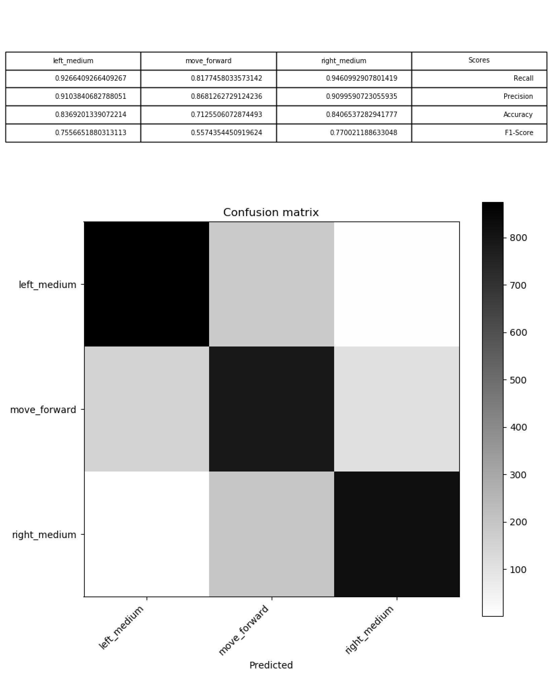

# Train a machine learning model locally

In this tutorial we are going to take a closer look at that happens when we train a machine learning model. As a prerequisite make sure you have some training data collected as described [here](4_AutCar_General.md#create-training-data) or [here](3_Autonomous_Driving.md#2-capture-training-data).

## The AutTrainer module

Suppose have training data, now let's see how we can use it. AutCar offers a module called _AutTrainer_ which provides several methods to help you with training a model. The first method we'll take a look at is `create_balanced_dataset()`. This method does two things: First, it balances the dataset. It's unlikely that we use all commands (move, left, right...) the same number of times. But to create an unbiased model, all classes should appear roughly uniformly. `create_balanced_dataset()` is **upsampling** the data by simply copying underrepresented classes. Second, the method also splits our data into a **training** and a **test** set. While data in the training set is used to train the model, images in the test set are only used to evaluate model performance. And for a meaningful evaluation we have to use data, the model has not seen before durng training.

To create a balanced dataset, use the following code:

   ```python
  from autcar import Trainer

  trainer = Trainer()
  trainer.create_balanced_dataset(input_folder_path = "path/to/trainingdata", output_folder_path = "path/to/trainingdata_balanced", train_test_split = 0.7)

  ```

The argument `input_folder_path` tells the trainer where our folder created by _AutCapture_ is located. `output_folder_path` can be an arbitrary path to location where the balanced dataset should be created. `train_test_split` tells our method how much training images should go into the training set (in this case 70%). 

Let's use another method to see which and how many labels we have in our dataset. Add the following code:

   ```python
  labels = trainer.get_classes("path/to/trainingdata_balanced")
  print(labels)

  ```
  
This should print the labels we have in the dataset and the corresponding amount on the console, for example:

  ```
  {'move_medium_forward': 195, 'right_medium_forward': 198, 'left_medium_forward': 186}
  ```
  
In this example we just used three commands to drive our car: "move_medium_forward", "right_medium_forward" and "left_medium_forward". In total, there are 12 possible commands to control the car. Each of these commands has a number assigned to it as shown in the image below:


When a machine learning model makes predictions, it doesn't output text. It always outputs number. We have to map these numbers back to useful labels which means, if the model outputs for example "6" the corresponding command is "move the car forward with medium speed".

## Convolutional Neural Network basics

Before we get predictions, we have to define our model and we'll use a Convolutional Neural Network (CNN) to do this job. Look at the images below: These are typical examples of what the car sees and the text below tells us what command we would expect to be executed when an image like this appears in front of the car:

  

  CNNs are sequences of operations stacked on each other. We start with an input layer that represents our image. Next, the image goes through a "Convolution layer" (in Keras the corresponding method is called "Conv2D"). Then the image is scaled down in a layer called "MaxPool2D". This happens a few times until the 2D images is converted to a 1D vector through "Flatten". In the end we have a fully connected 1D "Dense" layer consisting of 12 neurons representing the 12 possible movements the car can make. This vector holds probabilities, so for example if the output vector for one image looks like this `[0.05,0.05,0.8,0.1,0,0,0,0,0,0,0,0]` the highest probability is at index 2 which is equivalent to the command "left medium backwards".
  
  In Keras, the CNN as described above can be implemented as follow:

  ```python
  from keras.models import Sequential
  from keras.layers import Dense, Conv2D, MaxPool2D, Flatten, InputLayer
  
  model = Sequential([
    InputLayer(input_shape=[3,168,224]),
    Conv2D(filters=32, kernel_size=5, strides=1, padding='same', activation='relu'),
    MaxPool2D(pool_size=8, padding='same'),
    Conv2D(filters=48, kernel_size=3, strides=1, padding='same', activation='relu'),
    MaxPool2D(pool_size=5, padding='same'),
    Conv2D(filters=64, kernel_size=3, strides=1, padding='same', activation='relu'),
    MaxPool2D(pool_size=3, padding='same'),
    Conv2D(filters=32, kernel_size=5, strides=1, padding='same'),
    Flatten(),
    Dense(100, activation='relu'),
    Dense(12, activation='softmax')
  ])
  ```
  
  Let's take a closer look at the single steps here: "InputLayer" needs the shape of our image, the standard size we use is 3 channels (Red, Green, Blue = RGB), 168 pixel height and 224 pixel width. Next, the convolutional operation takes place. Here, we define a set of filters which are sliding over the image whereby the pixel values of the filter and the underlying part of the image are multiplied. The filter generates a large "pulse" when it moves over regions that are similar to the filter pattern (note: In the image below these results are represented as grey boxes in the filter map, in a real CNN, these values would be numbers)
  
  
  
  In the "MaxPool2D" layer, the created feature map is resized to a smaller matrix:
  
  

## Train and evaluate the model

After we have defined our model, let's train it. _AutTrainer_ provides a method called `train()` which does most of the job for us:

  ```python
  trainer.train(path_to_folder="path/to/trainingdata_balanced", model_definition=model, epochs=5, output_model_path="driver_model.onnx")
  ```
  
  `path_to_folder` is the path to our balanced dataset containing a _train_map.txt_ and a _test_map.txt_ file. `model_definition` is the `Sequential` model object we defined above. `epochs` is a hyperparameter that tells our trainer how often the full training image set should flow through our CNN. The higher this number is, the better the model adapts to the training data (this is not necessarily a desired effect, see [Bias–variance tradeoff](https://en.wikipedia.org/wiki/Bias%E2%80%93variance_tradeoff)). Finally, `output_model_path` tells the trainer where the trained model should be placed. The model file contains the definition of the model we defined and the learned weights.

We have trained a model. But is it "good"? What does "good" mean anyway? There are several measures that tell us if a model is good:

1) **Accuracy**: This is simply the number of all correctly classified images divided by the number of total images. Suppose we have 10 images of "drive left" in our test set and 8 of them were correctly classified as "drive left" by our model - the accuracy is 80%

2) **Precision**: How many of the images that were classified as "drive left" are actually "drive left"? Suppose our model predicts that 8 images are "drive left" but just 4 of these images are really "drive left". The precision in that case is 50%.

3) **Recall**: Measures how good the model is at finding certain classes. For example, if there are 10 "drive left" images in total and the model finds 7 of them, recall is 70%.

4) **F1-Score**: Since there is a certain dependency between precision and recall (if you are stricter and use only the predictions for which the model gives high probability score, increase precision but decrease recall and vice versa), we can define a metric that combines both. F1 score is the harmonic mean of precision and recall.
  
  With _AutTrainer_ we get a list of all these score per class by executing the `test()` method. There are two parameters needed: The model file in ONNX format we trained earlier and the path to the `test_map.txt` file in our "trainingdata" folder:
  
  ```python
  trainer.test(path_to_model="driver_model.onnx", path_to_test_map="path/to/trainingdata_balanced/test_map.txt")
  ```
  
  The output looks like this:
  
  
  
  Additionally to our scores, we also get a **confusion matrix**. The columns represent the predict classes of the model, the rows the actual classes. In a good model, the diagonal squares should be clearly darker then the rest. 
  
  To finally answer the question if our model is good, we have to ask ourselves: What are the "costs" of wrong predictions? Suppose our model confuses "left" and "forward" from time to time. This is certainly bad, but since the car is moving constantly and we get frequently new images, the car can correct these mistakes easily. Suppose our model confuses "left" and "right" from time to time. Here the implication is worse, it means out car will start to turn right in a left turn, this is certainly harder to correct in the next prediction round.
