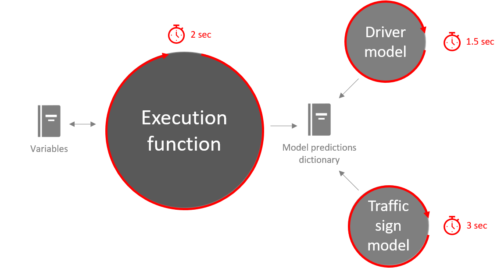

# Run multiple models on the car with a custom execution function

The goal of this tutorial is to execute two models on the car, one following the track and one recognizing traffic signs. The car should behave accordingly.

## Prerequisites

Make sure you have two models prepared you want to test. For this tutorial, we use a model that follows a track as described [here](3_Autonomous_Driving.md) and another model which recognizes traffic signs as described [here](5_Customvision.md). Our second model uses a custom image preprocessor, we'll reuse this here. All in all, this is the code we'll start with:

```python
from autcar import Car, Driver, Camera, Model
import numpy as np
import time
import cv2

car = Car()
cam = Camera(rotation=-1)

class OwnModel(Model):
  def preprocess(self, image):
    image = image.convert('RGB')
    r,g,b = np.array(image).T
    image = np.array([b,g,r]).transpose()
    h, w = image.shape[:2]
    min_dim = min(w,h)
    startx = w//2-(min_dim//2)
    starty = h//2-(min_dim//2)
    image = image[starty:starty+min_dim, startx:startx+min_dim]
    resized_image = np.array([cv2.resize(image, (224, 224), interpolation = cv2.INTER_LINEAR)])
    
    return resized_image
    
model_drive = Model("driver_keras.onnx", execution_interval=1.5)
model_traffic_sign = OwnModel("trafficsign.onnx", execution_interval=3)

```

## Movements of the car

We have two model objects `model_drive` and `model_traffic_sign` ready to work with. Let's define the logic the car should follow: In general it should just follow the track, this is the job of _model_drive_. When a stop sign is visible, the prediction of _model_traffic_sign_ should overrule the predictions of _model_drive_ - the car should stop for a few seconds. Then, the car should continue driving but since it hasn't moved, it will recognize the stop sign again and stop. To prevent this, we ignore every sign recognition for a few iterations. When a priority road sign is recognized, the car should drive faster for a few seconds and get back to normal after a few seconds.

Let's try to bring the logic above into a Python function.

When you have trained your `model_drive` model with `train()` of "AutTrainer", the model has 12 possible outputs. This corresponds to the 12 possible ways the car can move. Sorted alphabetically, here are the 12 movements and the corresponding class labels:


So, when `model_drive` outputs "0" it means drive a little bit to the left backwards. If it outputs "4" it means move fast forward and so on. In our training, it is unlikely that we use all commands, therefore a lot of labels will not be used.

## Write the execution function

Let's assume we just used the commands left light, left medium, forward, right light and right medium (1, 3, 6, 8, 10) while training the model. The first thing we do is defining an execution function and getting the predictions from the two models:

```python
def execute(model_predictions: dict, car: Car, variables: dict):
  trafficsign_prediction = model_predictions["trafficsign.onnx"][0]
  drive_predictions = model_predictions["driver_keras.onnx"]
  drive_predictions_current = drive_predictions[0]
  drive_predictions_last = drive_predictions[1]

```

Our _execute_ function gets three arguments by the Driver class: A dictionary holding all the predictions of our models, the car object and a dictionary "variables" when can use the store temporary values. Take a look at line 3: With `model_predictions["trafficsign.onnx"][0]` we get the current prediction of model _trafficsign.onnx_. The return value is a list so `model_predictions["trafficsign.onnx"][1]` would give the previous prediction. We get predictions from both models, the driver and the traffic sign detector. 

Next, we add code to control the car based on the predictions of the _driver_keras.onnx_ model. Add the following to the function:

```python
if(drive_predictions_current != drive_predictions_last):
  if(drive_predictions_current == 1):
    car.left("light")
  elif(drive_predictions_current == 3):
    car.left("medium")
  elif(drive_predictions_current == 6):
    car.move("forward")
  elif(drive_predictions_current == 8):
    car.right("light")
  elif(drive_predictions_current == 10):
    car.right("medium")

```

If there is a difference between the current and the last prediction, enter the if-else statement and check for direction predictions. "1" stands for "drive left light", so when our model has predicted "1", tell our car to turn left. The same applies to every other direction.

Next, write the code block for the traffic sign prediction behavior:

```python
if(trafficsign_prediction == 0):
  print("No traffic sign detected")
elif(trafficsign_prediction == 1):
  print("Major road sign detected")
elif(trafficsign_prediction == 2):
  if("ignore_stop_counter" in variables and variables["ignore_stop_counter"] > 0):
    print("Stop sign detected but ignored")
  else:
    print("Stop sign detected")
    car.stop()
    time.sleep(4)
    variables["ignore_stop_counter"] = 4
```

If no traffic sign was detected, we just print the result on the console. If a priority road sign was detected, we also just output this on the result. However, for stop signs, we call `car.stop()` and stop the car for 4 seconds. Next we add a new entry to out dictionary called "ignore_stop_counter": This counter will be decremented till it reaches 0. While the counter is greater than 0, all new predictions of stop signs will be ignored.

Finally, we create the driver and hand over all needed arguments:

```python
driver = Driver([model_drive, model_traffic_sign], car, cam, execution_function=execute, execution_interval=2)
driver.start()
```

We can pass two or models in a list to the `Driver` object. Additionally, we have to hand over a car and camera object and define the function that should be executed. With `execution_interval` we define that our execution function should run every 2 seconds. Note: The execution of the function is completely independent from the execution of the models: It's possible that we collect predictions faster than we're doing something with them. In fact, we have defined three different time intervals for the execution function and the two models:



The complete code to control the car looks as follow:

```python
from autcar import Car, Driver, Camera, Model
import numpy as np
import time
import cv2

car = Car()
cam = Camera(rotation=-1)

class OwnModel(Model):
    def preprocess(self, image):
        image = image.convert('RGB')
        r,g,b = np.array(image).T
        image = np.array([b,g,r]).transpose()
        h, w = image.shape[:2]
        min_dim = min(w,h)
        startx = w//2-(min_dim//2)
        starty = h//2-(min_dim//2)
        image = image[starty:starty+min_dim, startx:startx+min_dim]
        resized_image = np.array([cv2.resize(image, (224, 224), interpolation = cv2.INTER_LINEAR)])

        return resized_image

model_drive = Model("driver_keras.onnx", execution_interval=1.5)
model_traffic_sign = OwnModel("trafficsign.onnx", execution_interval=3)

def execute(model_predictions: dict, car: Car, variables: dict):

    trafficsign_prediction = model_predictions["trafficsign.onnx"][0]
    drive_predictions = model_predictions["driver_keras.onnx"]
    drive_predictions_current = drive_predictions[0]
    drive_predictions_last = drive_predictions[1]

    if("ignore_stop_counter" in variables):
        if(variables["ignore_stop_counter"] == 4):
            drive_predictions_last = None
        if(variables["ignore_stop_counter"] > 1):
            variables["ignore_stop_counter"] -= 1

    print(drive_predictions)

    if(drive_predictions_current != drive_predictions_last):
        if(drive_predictions_current == 1):
            car.left("light")
        elif(drive_predictions_current == 3):
            car.left("medium")
        elif(drive_predictions_current == 6):
            car.move("forward")
        elif(drive_predictions_current == 8):
            car.right("light")
        elif(drive_predictions_current == 10):
            car.right("medium")

    if(trafficsign_prediction == 0):
        print("No traffic sign detected")
    elif(trafficsign_prediction == 1):
        print("Major road sign detected")
    elif(trafficsign_prediction == 2):
        if("ignore_stop_counter" in variables and variables["ignore_stop_counter"] > 0):
            print("Stop sign detected but ignored")
        else:
            print("Stop sign detected")
            car.stop()
            time.sleep(4)
            variables["ignore_stop_counter"] = 4


driver = Driver([model_drive, model_traffic_sign], car, cam, execution_function=execute, execution_interval=2)
driver.start()
```

Now, put your car on the track, execute the script and see how the car behaves!
