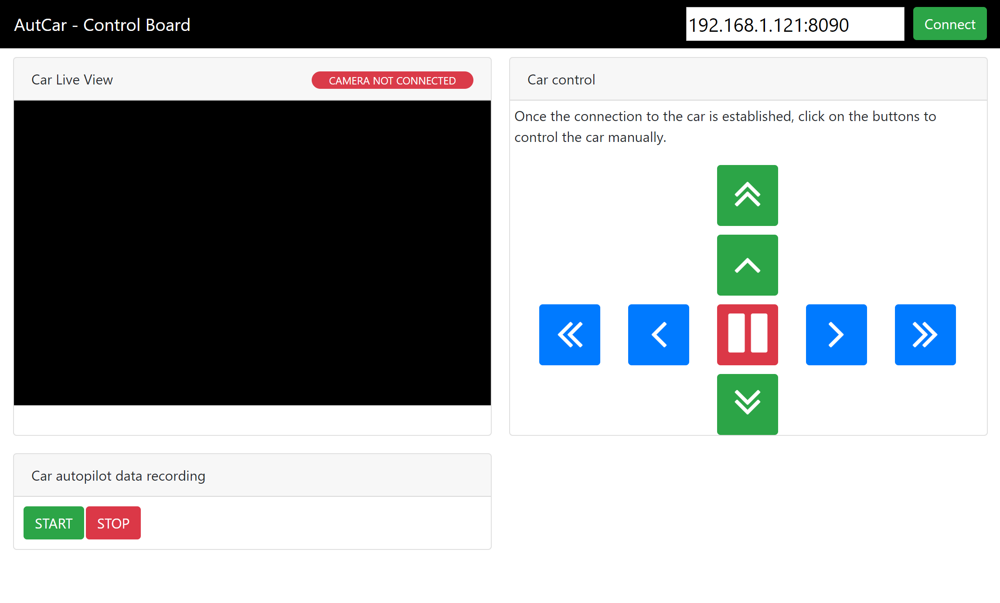

# Software Setup

In this chapter, you'll learn how to install the AutCar library both on your Raspberry Pi and PC and connect to your car.

### 1) Prerequisites

You'll need the following:
- A PC and either a wirless access point or an Ethernet connection
- A micro SD card
- A micro SD card reader or a built-in SD card reader on your computer
- Your AutCar (configuration is shown in the [Hardware Assembly documentation](https://github.com/christian-vorhemus/autcar/blob/master/docs/Hardware_Assembly.md))

### 2) Configure your Raspberry Pi

If you already have a Rasperry Pi 3 with the newest Raspbian Lite up and running, you can skip this section.

1) Download Raspbian Lite from [here](https://www.raspberrypi.org/downloads/raspbian/)
2) Download a tool to write disk images to a SD card. On Windows, you can use [Win32 Disk Imager](https://www.heise.de/download/product/win32-disk-imager-92033)
3) Download a SSH client, for example [PuTTY](https://www.chiark.greenend.org.uk/~sgtatham/putty/latest.html)
4) Plug a SD card to your computer, start your disk image writer and write the Raspian .img file to the card
5) Open the /boot partition of the SD card, and create a new file named "wpa_supplicant.conf"
6) Add the following content to the file but replace &lt;YOUR-WIFI-SSID&gt; and &lt;YOUR-WIFI-KEY&gt; with the SSID (name) and password of your WLAN access point.
```
ctrl_interface=DIR=/var/run/wpa_supplicant GROUP=netdev
update_config=1
country=AT

network={
    ssid="<YOUR-WIFI-SSID>"
    psk="<YOUR-WIFI-KEY>"
    key_mgmt=WPA-PSK
}
```
6) Create an empty file "ssh" (no file ending!) on /boot partition to enable ssh
7) Start your Raspberry Pi and search on your WLAN access point which IP address your Raspberry Pi is using. Most access points provide a web interface you can use to find the IP address, however, the address of the web interface differrs from router to router. If you don't know it, open a browser and try 192.168.1.1, 10.0.0.1 or 10.0.0.138 to open the web interface and note down the IP address of your Raspberry.
8) Open PuTTY, enter the IP address of your Raspberry Pi and click "Open". The default credentials are
```
Username: pi
Password: raspberry
```

It is recommended to change your password. To do so, enter 
```
passwd
```
and change the default password.

### 3) Download and install AutCar on your Raspberry

1) If not done already, install Git. You can do so by entering the following command on your Raspberry Pi shell:
```
sudo apt-get -y install git
```

2) Download the AutCar library
```
git clone https://github.com/christian-vorhemus/autcar.git
```

3) Change directory to enter the /src folder of the downloaded /autcar folder
```
cd autcar/src/
```

4) Install the dependencies
```
python3 install.py
```
Installation can take up to 1 hour on a Raspberry Pi 3. A restart is required after the installation and will be performed automatically. If you want to prevent that, use the --prevent-reboot flag

```
python3 install.py --prevent-reboot
```
It can happen that installation fails due to network timeouts. In that case, just run the install script again until you see "Sucessfully installed AutCar platform!"


### 4) Download and install AutCar on your PC

Before you start, make sure that you have **Python 3.5 or newer** installed on your PC!

1) We also need the AutCar library on our PC. If you use Windows, go to [git-scm.com/download/win](https://git-scm.com/download/win) and download Git.
2) Open a command prompt and enter
```
git clone https://github.com/christian-vorhemus/autcar.git
```
3) Install the dependencies with
```
pip install -r autcar/src/autcar/web/requirements.txt
```

### 5) Connect to your car and drive!

1. On your Raspberry Pi, start the sample remote control script rc_sample.py
 ```
 python3 rc_sample.py
 ```

 Your car is now listening for commands (by default on port 8090)

2. On your PC, start the web client with
 ```
 python autcar/src/autcar/web/server.py
 ```
3. Open a browser and enter the address http://localhost:8080. You should now see the AutCar Control Board:
 
4. Enter the IP address and port of the car in the right upper corner and click on "Connect"<br>
5. Click on the car control buttons to manually move the car.

You should now be able to control the car manually, great! Next, let's see how we can enable autonomous driving mode, [click here](https://github.com/christian-vorhemus/autcar/blob/master/docs/Autonomous_Driving.md) to learn more.
